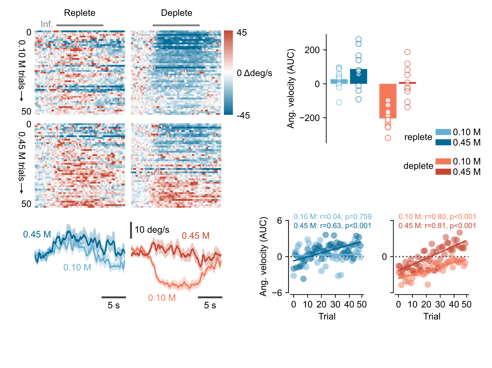
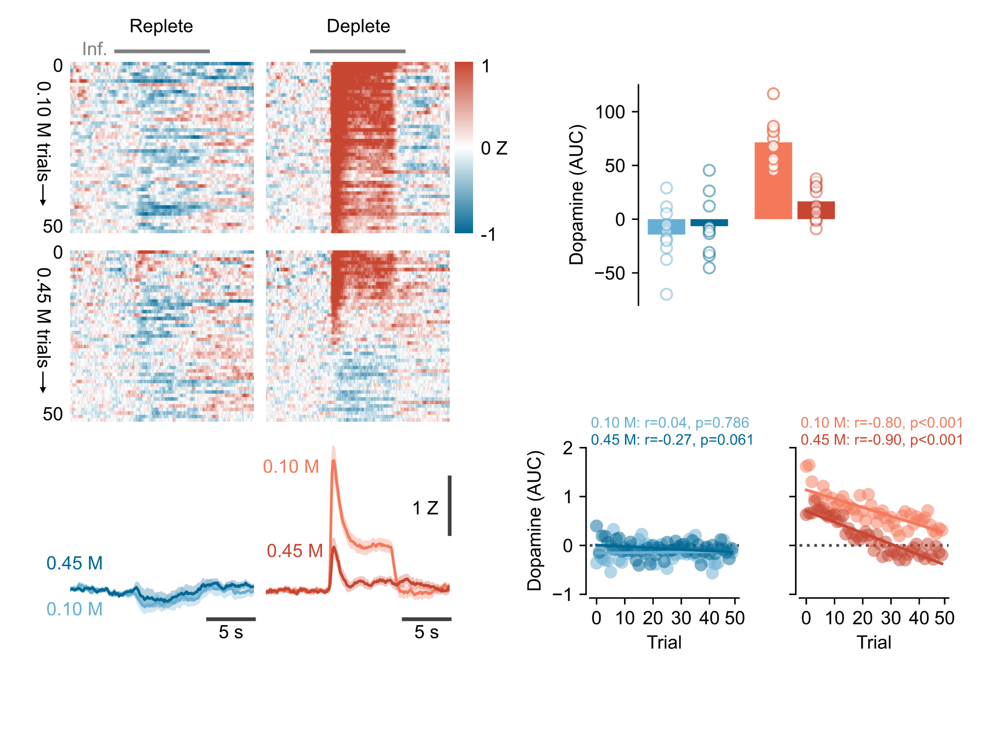
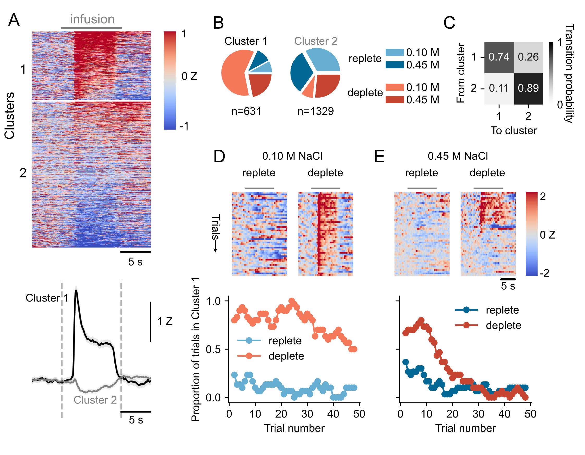

# Graphic novel for Bazzino study

## Provisional title(s)
Neural and behavioural signatures of rapid satiation of sodium appetite

## Pre-amble / introduction
The behavioural and neural responses associated with sodium appetite are readily reversible. Traditionally, this has meant that after induction of sodium appetite, animals are tested and then following this test they are allowed to replenish sodium overnight before being tested again. Few studies have investigated responses *during* replenishment.

## Methods
We designed a study that allowed deplete rats to become sodium-sated in the course of a single session

## Results

---

### Behavioural responses to NaCl
Movement of the head used to estimate the rat's responses. In general, reduction in velocity (stillness) reflects appetitive responses and an increase in velocity (head shakes) reflect aversive responses.
When rats are replete, both 0.1 M and 0.45 M infusions evoke a small increase in activity throughout the session (i.e., aversion) whereas when rats are deplete, 0.1 M infusions evoke a reduction activity throughout the session (i.e., appetitive). When deplete rats receive 0.45 M infusions, responses at the beginning of the session are appetitive whereas those at the end are aversive. This switch is seen most clearly in the AUC (or time moving)-by-trial figure (Fig. 1). This is fit best with a linear/exponential.

### Dopamine responses to NaCl
Fibre photometry of xxx used to measure dopamine release in nucleus accumbens core (?) during infusions. In the replete state, dopamine responses are minimal to either concentration. In the deplete state, 0.1 M infusions evoke large dopamine responses, which are maintained throughout the session. On the other hand, 0.45 M infusions generate large dopamine responses in early trials but decrease rapdily as the session progresses. Again, AUC analysis shows these decreases across time. 0.45 M deplete are especially interesting as - simpliar to the behaviour - dopamine responses seem to go from one state to the other from the beginning to the end of the session

### Responses in individual rats
Although averaged data appeared to reflect a smooth transition from one state to the other (either linear or exponential, fig ref), inspection of individual rats suggested that the change might be more abrupt and, moreover, appeared at a different point in the session for each rat (show figs for 3 rats with behav and dopamine and trial by trial). Such changes were only seen in deplete high concentration rats. We were first interested in whether changes in DA and behaviour across the session had a consistent lag/direction so performed cross correlation. This identified that in the majority of cases the change in dopamine signal happened at the same time or earlier than the change in behaviour.

### Realignment of traces
To further investigate this and to understand whether changes in dopamine and behaviour were more abrupt in individuyal rats than the average suggested, we calculated a transition point for the dopamine signal (i.e., the trial at which dopamine state changed). We used this transition point to realign both dopamine and behaviour and found that now the steepness of transition of both signals was more abrupt. This effect was particularly salient for behavioour. In addition, supporting the lag analysis, the reduction in dopamine preceded the behavioural switch.

### Clustering of dopamine responses
From the grouped data (Fig. x), dopamine responses appear to decrease in a graded way as the session progresses. However, we wondered whether this was an artifact of averaging together several more "step-like" responses in individual rats. When considering all trials from all rats under all conditions together, an unbiased spectral clustering method, found that responses could be place in two main clusters. The profile of Cluster 1 trials showed a sterotpyical large transient dopamine response at the beginning of the infusion, followed by a plateau. Cluster 2 trials had no or little dopamine response. Show silhouette scores too.

As expected, dopamine responses in replete rats were almost entirely Cluster 2-like whereas dopamine responses in deplete rats receiving 0.1 M NaCl were almost all Cluster 1-like. For deplete rats experiencing 0.45 M, dopamine responses were equally shared between Cluster 1 and Cluster 2.

### Identifying transition points for the dopamine signal
We focused in on deplete rats experiencing 0.45 M infusions as their behavioural and neural data suggested that their responses to NaCl reversed during the session, possibly reflecting them reaching satiety. We wanted to test - in indidual rats - whether this switch from one physiological state to the other was graded or abrupt. For each rat, we plotted whether each of the 50 trials fell into Cluster 1 or Cluster 2 and fitted a logistic function. Importantly, the output of this function includes a term reflecting the transition point from one state to the other. This function was well-fitted for x/10 rats and we found that the transition points varied from x trials to x trials (mean = x).

### Mapping dopamine transitions onto behavioural data

### Things I have tried which haven't played out

## Future work and ideas
1. Purely behavioural study using the same infusion/depletion protocol but videoing conventional taste reactivity at the same time as bird-eye view so that we can try to link them.

2. Study using different direct (pharmacological) stimulators of sodium appetite (or thirst?) and using different concentrations to try to produce parametric changes. Could have a range of doses of the drug and a range of concentrations and test them all within subject?

3. Preference tests for different concentrations of NaCl when deplete under different access conditions. Basically, do rats always prefer the high concentration (even though lower concentrations are more palatable). How can you pull these different forms of preference apart? Can you do something cool with lick microstructure vs infusions?

4. Amiloride