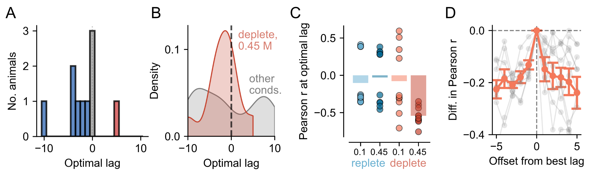
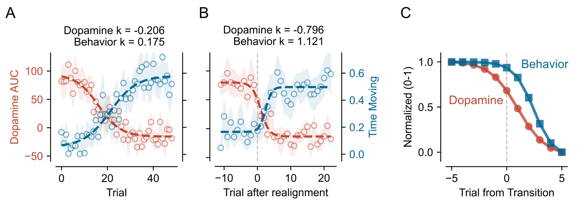

# Graphic novel for Bazzino study

## Provisional title(s)
Neural and behavioural signatures of rapid satiation of sodium appetite

## Pre-amble / introduction
The behavioural and neural responses associated with sodium appetite are readily reversible. Traditionally, this has meant that after induction of sodium appetite, animals are tested and then following this test they are allowed to replenish sodium overnight before being tested again. Few studies have investigated responses *during* replenishment.

## Methods
We designed a study that allowed deplete rats to become sodium-sated in the course of a single session

## Results

---

### Behavioural responses to NaCl
Movement of the head was used to estimate the rat's responses to infusions. In general, reduction in velocity (e.g., stillness) reflects appetitive responses and an increase in velocity (e.g., head shakes) reflect aversive responses.
When rats are replete, both 0.1 M and 0.45 M infusions evoke a small increase in activity throughout the session (i.e., aversion; Fig. 1A) whereas when rats are deplete, 0.1 M infusions evoke a reduction activity throughout the session (i.e., appetitive; Fig. 1B, top heatmap). When deplete rats receive 0.45 M infusions, responses at the beginning of the session are appetitive whereas those at the end are aversive (Fig. 1B, bottom heatmap). This pattern is reflected in the average time moving per trial for each condition (Fig. 1C) and the switch between states is seen most clearly in the time moving-by-trial figure (Fig. 1E).

### Dopamine responses to NaCl
Fibre photometry of GRAB-DA1h was used to measure dopamine release in nucleus accumbens lateral shell during infusions. In the replete state, dopamine responses are minimal to either concentration (Fig. 2A). In the deplete state, 0.1 M infusions evoke large dopamine responses, which are maintained throughout the session (Fig. 2B, top heatmap). On the other hand, 0.45 M infusions generate large dopamine responses in early trials but decrease rapdily as the session progresses (Fig. 2B, bottom heatmap). Again, AUC analysis shows these decreases across time. 0.45 M deplete are especially interesting as - simpliar to the behaviour - dopamine responses appear to transition from one state to the other as the session progresses (Fig. 2E).

### Responses in individual rats
Although averaged data in general suggested either no change or a smooth transition from one state to the other (supported by linear fits being most appropriate for most conditions), for the deplete rats receiving high concentration NaCl (0.45 M) both behavioral and dopamine data were best fitted with a sigmoid reflecting a transition from one state to another (Table S1). While the steepness parameter (k) of the sigmoid fitted to the mean data indicated a relatively gradual transition, inspection of data from individual rats suggested that the change might be more abrupt. Moreover, the transition appeared at a different point in the session for each rat (show figs for 3 rats with behav and dopamine and trial by trial; Fig. Sx). Importantly, such changes were only seen in deplete high concentration rats.

Figure of individual rats, Fig. S1

### Correlation of behavior and dopamine
We were first interested in whether changes in dopamine and behaviour across the session had a consistent lag/direction so performed cross correlation. We focused on the deplete-high concentration rats and found that for the majority the change in dopamine signal happened at the same time or earlier than the change in behaviour (Fig. 3A). Corrlating signals for other conditions (i.e., replete both concentrations and deplete low concentration) produced inconsistent lags and fits (both positive and negative, Fig. 3B and 3C).

### Clustering of dopamine responses
To further investigate this and to understand whether changes in dopamine and behaviour were more abrupt in individual rats than the average suggested, we calculated a transition point for the dopamine signal (i.e., the trial at which dopamine state changed). We found transition points for the dopamine signal by performing unbiased clustering of dopamine responses. When considering all trials from all rats under all conditions together, spectral clustering revealed that responses could be place in two main clusters. The profile of Cluster 1 trials showed a sterotpyical large transient dopamine response at the beginning of the infusion, followed by a plateau. Cluster 2 trials had no or little dopamine response.

As expected, dopamine responses in replete rats were almost entirely Cluster 2-like whereas dopamine responses in deplete rats receiving 0.1 M NaCl were almost all Cluster 1-like. For deplete rats experiencing 0.45 M, dopamine responses were equally shared between Cluster 1 and Cluster 2.

### Identifying transition points for the dopamine signal
We focused in on deplete rats experiencing 0.45 M infusions as their behavioural and neural data suggested that their responses to NaCl reversed during the session, possibly reflecting them reaching satiety. We wanted to test - in indidual rats - whether this switch from one physiological state to the other was graded or abrupt. For each rat, we plotted whether each of the 50 trials fell into Cluster 1 or Cluster 2 and fitted a logistic function. Importantly, the output of this function includes a term reflecting the transition point from one state to the other. This function was well-fitted for 8/10 rats and we found that the transition points varied from Trial 11 to Trial 26 (mean = Trial 18).

### Realignment of signals
Fitting of the mean dopamine and behavior sigmals with a sigmoidal function produced steepness values (ks) of -0.206 and 0.175, respectively (Fig. 4A). However, using the transition point of the dopamine signal using clusters, we were able to realigned both dopamine and behaviour and found that now the steepness of transition of both signals was more abrupt (-0.796 and 1.121, respectively, Fig. 4B). We confirmed that this sharpening of the transition point was specific to each rat but shuffling transition points among rats and re-fitting sigmoids to obtain a bootstrapped distribution. This showed that the magnitude of the steepness parameter was greater when data were realigned to each rat's specific transition than when aligned to a random rat (Fig. Sx). In addition, supporting the lag analysis, the reduction in dopamine preceded the behavioural switch (Fig. 4C).

### Mapping dopamine transitions onto behavioural data

### Things I have tried which haven't played out

## Future work and ideas
1. Purely behavioural study using the same infusion/depletion protocol but videoing conventional taste reactivity at the same time as bird-eye view so that we can try to link them.

2. Study using different direct (pharmacological) stimulators of sodium appetite (or thirst?) and using different concentrations to try to produce parametric changes. Could have a range of doses of the drug and a range of concentrations and test them all within subject?

3. Preference tests for different concentrations of NaCl when deplete under different access conditions. Basically, do rats always prefer the high concentration (even though lower concentrations are more palatable). How can you pull these different forms of preference apart? Can you do something cool with lick microstructure vs infusions?

4. Amiloride